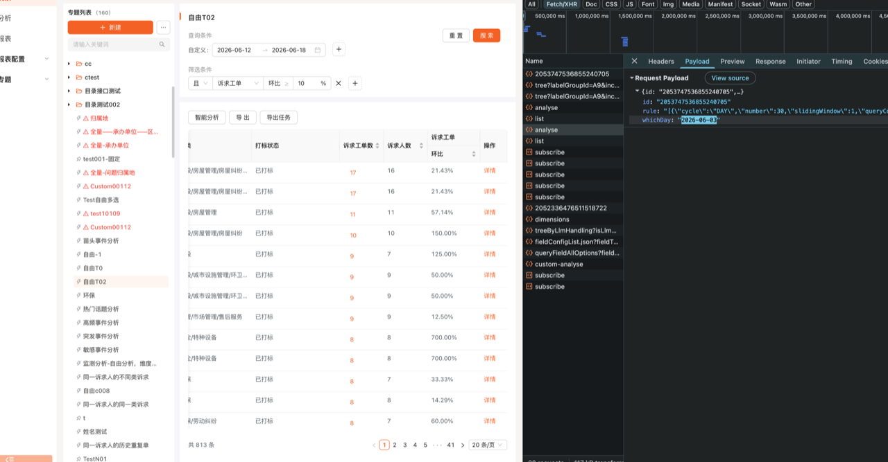
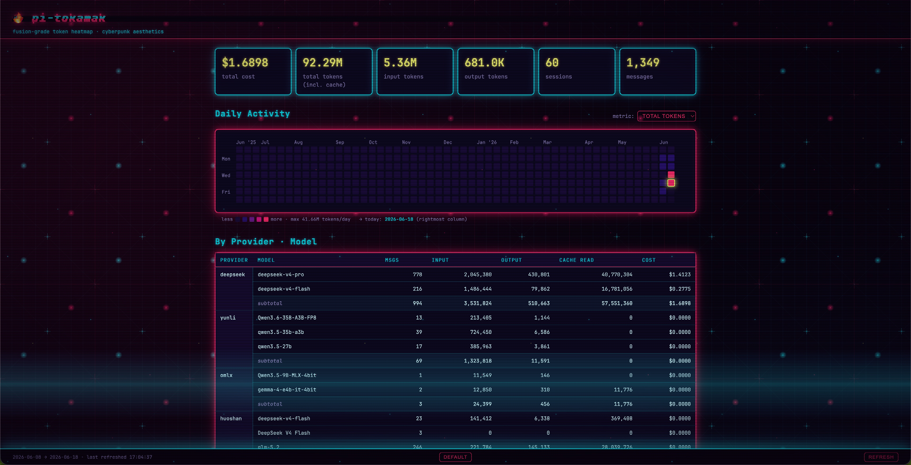

# pi-tokamak 🔥

Fusion-grade token heatmaps for your [pi coding agent](https://pi.dev) — with cyberpunk aesthetics.



---

## What it does

pi-tokamak reads your local pi session logs (`~/.pi/agent/sessions/**/*.jsonl`) and renders a beautiful dashboard right in your browser:

- 📊 **Summary cards** — total cost, tokens (input / output / cache), sessions, messages
- 🟩 **GitHub-style heatmap** — daily token activity over the last 12 months, switchable by metric (cost, tokens, messages, etc.)
- 🤖 **Provider & model breakdown** — see which providers and models eat your budget
- 📅 **Monthly & daily tables** — drill into every day's consumption
- 📁 **Project breakdown** — which project is the token hog?
- 🌐 **Cyberpunk theme** — toggle in the footer for neon grid, scanline, CRT glitch effects

All data stays on your machine. No telemetry, no cloud.

---

## Quick Start

### CLI — standalone dashboard

```bash
npm install -g pi-tokamak
tokamak
```

Opens `http://127.0.0.1:<random-port>` in your browser.

### In pi agent — AI-native tools

Install as a pi extension, and your agent can call `tokamak` / `tokamak_stats` / `tokamak_stop` directly:

```bash
pi install npm:pi-tokamak
```

**Restart pi** after install. The extension registers three tools and two slash commands:

| Name | Type | What it does |
|---|---|---|
| `tokamak` | Tool | Start/reuse dashboard, returns URL + token summary |
| `tokamak_stats` | Tool | Return token stats only — no browser, perfect for quick inline queries |
| `tokamak_stop` | Tool | Kill the tokamak server and free the port |
| `/tokamak` | Command | Slash command to open the dashboard |
| `/tokamak-stop` | Command | Slash command to stop the server |
| `/tokamak-stats` | Command | Slash command to query stats inline |

Once installed, just say things like:

> "查看我的 token 用量"  
> "我花了多少钱"  
> "token 统计"  
> "打开 tokamak"  
> "关掉 tokamak"

The agent will pick the right tool automatically — no bash scripts, no manual CLI invocation.

---

## CLI Options

```
tokamak [options]

  -p, --port <n>         server port (default: random)
  --no-open              don't open browser
  --session-dir <path>   pi sessions dir (default: ~/.pi/agent/sessions)
  -h, --help             show help
  -v, --version          show version
```

---

## Cyberpunk Theme



Click the **cyberpunk** button in the footer to toggle. Features:

- CRT scanline grid background (SVG pattern)
- Neon pink / cyan / yellow color palette
- Multilayer box-shadow glow on cards and tables
- Glitch text effect on the header (`::before` / `::after` with clip-path keyframes)
- Row hover "power-on" sweep in tables
- Monospace font (`JetBrains Mono` / `SF Mono`)

Theme preference persists via `localStorage`.

---

## How it works

Pi records each assistant message's `usage` block in JSONL session logs. pi-tokamak parses and aggregates them with zero dependencies on pi internals.

```json
{
  "type": "message",
  "message": {
    "provider": "deepseek",
    "model": "deepseek-v4-pro",
    "usage": {
      "input": 808,
      "output": 1834,
      "cacheRead": 75648,
      "cacheWrite": 0,
      "cost": { "total": 0.002221 }
    }
  }
}
```

---

## Architecture

```
pi-tokamak/
├── bin/tokamak.mjs          # CLI entry — parse args, start server
├── src/
│   ├── server.mjs           # HTTP server (Node built-in http, static + /api/stats)
│   └── aggregator.mjs       # Parse JSONL → aggregate stats
├── public/                  # Dashboard frontend (zero framework)
│   ├── index.html
│   ├── style.css            # CSS vars — cyberpunk overrides via [data-theme]
│   ├── app.js               # Fetch /api/stats → render heatmap + tables
│   └── bg-cyberpunk.svg     # Cyberpunk scanline grid background
├── extensions/tokamak/
│   └── index.ts             # Pi agent extension — 3 tools + 2 slash commands
├── test/
│   └── aggregator.test.mjs
└── docs/
    ├── screenshot-default.png
    └── screenshot-cyberpunk.png
```

---

## License

MIT © kedong
